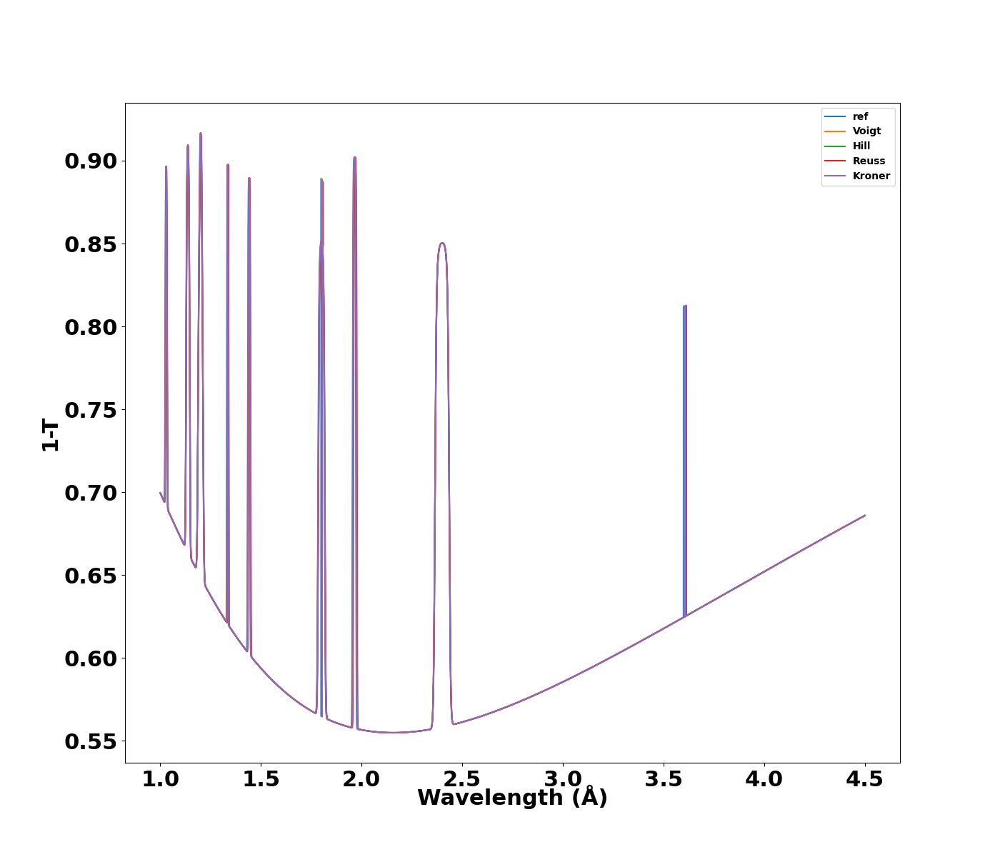

Tutorial
========

Please see :ref:`installation` before start here.

This tutorial walks through some basic steps of using sinpol for modelling  the neutron transmission spectra of single crystal and  the neutron Bragg edge spectrum of polycrystals 
The input parameters in sinpol consitst of three different input blocks, crystal data, sample data  instrument data.
To start the calculation, we import some essential tools::

  import os, numpy as np
  import matplotlib.pyplot as plt
  import sys
  import warnings
  from sinpol import sampledata as sd
  from sinpol import crystaldata as cds
  from sinpol import scatteringcal as sctt
  from sinpol import  stressstrainmodels as ss

 

Crystal Data 
----------------

The first step is to create a model of the material. Here we use fcc Cu as the example. In the following, we create the atomic structure by adding the lattice parameters, the atomic positions, the miller indices, and the meso neutronics::

  
    lattice=np.array([[ 3.61496,3.61496,3.61496,90,90,90]])
    atp =np.array([[0,0,0],[0,0.5,0.5],[0.5,0,0.5],[0.5,0.5,0]])

    hkl =np.array([[2,2,0],[0,2,2],[2,0,2],[2,-2,0],
    [-2,2,0],[0,-2,2],[0,2,-2],[-2,-2,0],[0,-2,-2],
    [-2,0,-2],[-2,0,2],[2,0,-2],[2,0,0],[0,2,0],[0,0,2],
    [0,-2,0],[-2,0,0],[0,0,-2],[1,1,1],[1,1,-1],[1,-1,1],
    [-1,1,1],[-1,-1,1],[-1,1,-1],[1,-1,-1],[-1,-1,-1]])

    cryn=np.array([7.718e-05,3.78e-08,7.485e-08,5.5e-09,8.035e-08, 
    8.488e-02,6.3546e+01,3.100e+02,1.057e+00]) 

.. note:: You can also use :code:`cds.CrystalData(path)` to load an atomic structure
   from a CIF file::

     from sinpol import crystaldata as cds
     xtal=cds.CrystalData('Cu.cif')
     lattice=xtal.cstructure(6,24)[0]
     atp=xtal.cstructure(6,24)[1]
     hkl=xtal.cstructure(6,24)[2]
     cryn=xtal.neutronics.dat

Sinpol has the ability to model the neutron transmsision both single crystal and polycrystal samples. The neutron transmission spectrum is wavelength (𝜆) dependent, so we will calculate the total cross-section determining the attenuations µ of neutron by matter functions of  𝜆.

First we de define a wavelength range::
  w = np.arange(1, 4.5, 0.001)
The total cross section that is calculated as the sum of three parts.
  .. math::
     \sigma_{total}=\sigma_{abs}+\sigma_{tds}+\sigma_{Bragg}
.. note:: The code below can be used to calculate absoprtion cross section and two part of the thermal diffuse 
  cross section ::
 
       absnxs=xtal.nxs.nxsAbsorption(w)
       Tdsspnxs=xtal.nxs.nxsTdssp(w)
       Tdsmpnxs=xtal.nxs.nxsTdsmp(w)
       Thermal diffuse cross section::
       tds= Tdsmpnxs+Tdsspnxs
       plt.figure()
       plt.plot(w,absnxs*1e8,label="Absorption")
       plt.plot(w,Tdsspnxs*1e8,label="Single Phonon")
       plt.plot(w,Tdsmpnxs*1e8,label="Multi Phonon")
       plt.plot(w,(Tdsmpnxs+Tdsspnxs)*1e8,label="TDS")
       plt.legend()
       plt.show()
It will generate this plot:

To calculate the contribution by the Bragg cross section to the neutron transmission signal we have to consider the input form the sample.  Next the various code  examples will compute the neutron transmission for single crystals, random texture polycrystal, texture polycrystal.   The four stress case will be applied on a single ond the random texture polycrystal,the stress-strain have not been implemented for the texture polycrystal.

Single Crystal
---------------

Create  Single Crystal Sample Inputs (Euler Angles)::

  from sinpol import crystaldata as cds
  xtal=cds.CrystalData('Cu.cif')
  lattice=xtal.cstructure(6,36)[0]
  atp=xtal.cstructure(6,36)[1]
  hkl=xtal.cstructure(6,36)[2]
  cryn=xtal.neutronics.dat
  w = np.arange(1, 4.5, 0.001)
  absnxs=xtal.nxs.nxsAbsorption(w)
  Tdsspnxs=xtal.nxs.nxsTdssp(w)
  Tdsmpnxs=xtal.nxs.nxsTdsmp(w)

  ptcm=1                  #  plate thickness in cm
  grainsize=1e4             #  grain size in microns
  orn=1                #  number of crystal orientation
  psi=0                   #  angles in lab frame
  omega=0                 #  angles in lab frame
  mosaic=.2               #  fwhm for mosaic in degrees
  phi_1= 0                #  Bunge angle in degrees
  PHI=86.5                #  Bunge angle in degrees
  phi_2=42.7              #  Bunge angle in degrees
  gdist='singlecrystal'   #  should be singlecrystal for single crystal 'singlecrystal'
  mdist= 'uniform'        #  choices are weibull, gaussian ,log_normal, and uniform
  dev=.0001               #  std for mosaic distributions in degrees   

  Create SampleData::

  samp=sd.SampleData(psi,omega,ptcm,grainsize,orn,mosaic).singlecrystaldeg(phi_1,PHI,phi_2,gdist,mdist,np.radians(dev))[0]
Applied Stress on sample and Calculate Strain ::

  stress=np.array([[0],[0],[0],[0],[0],[0]])
  C11=100
  C12=100
  C44=100
  strain=ss.StressStrainModels(samp[0],hkl,lattice,stress,C11,C12,C44).voigt()
Calculate Neutron Transmision::

  trans=ScatteringCalc(samp,hkl,lattice,atp,cryn,absnxs,Tdsspnxs,Tdsmpnxs,strain,a).transmission()
  plt.figure()
  plt.plot(w,1-trans)
  plt.xlim(1.0,4.0)

This plot reproduces Figure 6a of https://doi.org/10.1063/1.5002102:

Create  Single Crystal Sample Inputs (hkluvw)::

  from sinpol import crystaldata as cds
  xtal=cds.CrystalData('Cu.cif')
  lattice=xtal.cstructure(6,36)[0]
  atp=xtal.cstructure(6,36)[1]
  hkl=xtal.cstructure(6,36)[2]
  cryn=xtal.neutronics.dat
  w = np.arange(1, 4.5, 0.0001)
  absnxs=xtal.nxs.nxsAbsorption(w)
  Tdsspnxs=xtal.nxs.nxsTdssp(w)
  Tdsmpnxs=xtal.nxs.nxsTdsmp(w)

  ptcm=1                  #  plate thickness in cm
  grainsize=1e4           #  grain size in microns
  orn=1                   #  number of crystal orientation
  psi=0                   #  angles in lab frame
  omega=0                 #  angles in lab frame
  mosaic=.2               #  fwhm for mosaic in degrees
  hkluvw=np.array([[0,0,1,1,0,0]]) # hkluvw Rolling plane and rolling direction
  gdist='singlecrystal'   #  should be singlecrystal for single crystal 'singlecrystal'
  mdist= 'uniform'        #  choices are weibull, gaussian ,log_normal, and uniform
  dev=.0001               #  std for mosaic distributions in degrees   

  Create SampleData::

  samp=sd.SampleData(psi,omega,ptcm,grainsize,orn,mosaic).singlecrystalhkl(hkluvw,gdist,mdist,np.radians(dev))[0]
Applied Stress on sample and Calculate Strain ::

  stress=np.array([[0],[0],[0],[0],[0],[0]])
  C11=100
  C12=100
  C44=100
  strain=ss.StressStrainModels(samp[0],hkl,lattice,stress,C11,C12,C44).voigt()
Calculate Neutron Transmision::

  trans=ScatteringCalc(samp,hkl,lattice,atp,cryn,absnxs,Tdsspnxs,Tdsmpnxs,strain,a).transmission()
  plt.figure()
  plt.plot(w,trans)
  plt.xlim(1.0,4.0)

This plot reproduces Figure 1a of https://doi.org/10.1016/j.nimb.2019.09.010:

Polycrystal (Random texture)
----------

 Here we consider an isotropic fcc Cu sample, and the following code computes and reproduces Figure 7 of https://doi.org/10.1063/1.5002102::

  from sinpol import crystaldata as cds
  xtal=cds.CrystalData('Cu.cif')
  lattice=xtal.cstructure(6,36)[0]
  atp=xtal.cstructure(6,36)[1]
  hkl=xtal.cstructure(6,36)[2]
  cryn=xtal.neutronics.dat
  w = np.arange(1, 4.5, 0.01)
  absnxs=xtal.nxs.nxsAbsorption(w)
  Tdsspnxs=xtal.nxs.nxsTdssp(w)
  Tdsmpnxs=xtal.nxs.nxsTdsmp(w)

  ptcm=1           # in cm
  grainsize=1      # in microns
  orn=1000000      #  number of crystal orientation
  psi=0                   #  angles in lab frame
  omega=0                 #  angles in lab frame
  mosaic=.2               #  fwhm for mosaic in degrees
  gdist='uniform'         #  should be singlecrystal for single crystal 'singlecrystal'
  mdist= 'uniform'        #  choices are weibull, gaussian ,log_normal, and uniform
  gdev=5                  #  std for grain distribution
  mdev=.002               #  std for mosaic function distribution
  seed=1                  #  Seed for Halton sequence

Create SampleData::

  samp=sd.SampleData(psi,omega,ptcm,grainsize,orn,mosaic)..polycrystalrand(gdist,mdist,gdev,mdev,seed)[0]

Applied Stress on sample and Calculate Strain ::

  stress=np.array([[0],[0],[0],[0],[0],[0]])
  C11=100
  C12=100
  C44=100
  strain=ss.StressStrainModels(samp[0],hkl,lattice,stress,C11,C12,C44).voigt()
Calculate Neutron Transmision::

  trans=ScatteringCalc(samp,hkl,lattice,atp,cryn,absnxs,Tdsspnxs,Tdsmpnxs,strain,a).transmission()
  plt.figure()
  plt.plot(w,trans)
  plt.xlim(1.0,4.0)

.. image:: img/poly_rand.png

Polycrystal (Rolling texture)
----------

Here we introduce the effect of texture  by calculating the orientation distribution function in a voxel as a Gaussian function centered on a single crystal orientation corresponding to an ideal texture component denoted by the {h k l} crystallographic plane perpendicular on sample normal direction(ND) and the <u v w> direction along the rolling direction (LD).::
  
  from sinpol import crystaldata as cds
  xtal=cds.CrystalData('Cu.cif')
  lattice=xtal.cstructure(6,36)[0]
  atp=xtal.cstructure(6,36)[1]
  hkl=xtal.cstructure(6,36)[2]
  cryn=xtal.neutronics.dat
  w = np.arange(1, 4.5, 0.01)
  absnxs=xtal.nxs.nxsAbsorption(w)
  Tdsspnxs=xtal.nxs.nxsTdssp(w)
  Tdsmpnxs=xtal.nxs.nxsTdsmp(w)
  ptcm=1           # in cm
  grainsize=1      # in microns
  orn=1000000      #  number of crystal orientation
  psi=0                   #  angles in lab frame
  omega=0                 #  angles in lab frame
  mosaic=.2               #  fwhm for mosaic in degrees
  hkluvw=np.array([[0,0,1,1,0,0]]) # hkluvw Rolling plane and rolling direction
  gdist='uniform'         #  should be singlecrystal for single crystal 'singlecrystal'
  mdist= 'uniform'        #  choices are weibull, gaussian ,log_normal, and uniform
  gdev=5                  #  std for grain distribution
  mdev=.002               #  std for mosaic function distribution

This above code  reproduces Figure 2d  of https://doi.org/10.1016/j.nimb.2019.09.010: 

Polycrystal (Loading ODF or Pole figure)
----------
Sinpol has the ability to model the neutron transmsision for a sample by providing an ODF in terms of Bunge Euler angles in degrees.  The ODF can be provided as .txt file. Here we present the simulation
for a recrystralyzed  Aluminum sample , the euler distribution for this example can be found in the recrystEuler.txt file in the data folder.::

  from sinpol import crystaldata as cds
  xtal=cds.CrystalData('Al',4.049,4.049,4.049,90,90,90,410,'Fm-3m')
  lattice=xtal.cstructure(6,36)[0]
  atp=xtal.cstructure(6,36)[1]
  hkl=xtal.cstructure(6,36)[2]
  cryn=xtal.neutronics.dat
  w = np.arange(1, 5, 0.01)
  absnxs=xtal.nxs.nxsAbsorption(w)
  Tdsspnxs=xtal.nxs.nxsTdssp(w)
  Tdsmpnxs=xtal.nxs.nxsTdsmp(w)

  ptcm=1           # in cm
  grainsize=1      # in microns
  orn=1000000      #  number of crystal orientation
  psi=0                   #  angles in lab frame
  omega=0                 #  angles in lab frame
  mosaic=.5               #  fwhm for mosaic in degrees
  gdist='uniform'         #  should be singlecrystal for single crystal 'singlecrystal'
  mdist= 'uniform'        #  choices are weibull, gaussian ,log_normal, and uniform
  gdev=5                  #  std for grain distribution
  create sample by passing the distribution file  to the sampledata  class  sd.SampleData(0,0,ptcm,grainsize,orn,.5).polycrystalloadodf('uniform','uniform',5,.2,"recrystEuler.txt")[0]

  This above code  reproduces Figure 9d  of https://doi.org/10.1016/j.nimb.2019.09.010: 
  
 
Polycrystal (Loading Pole Figures)
----------

Elastic Strain  
----------
In this section  we  simulate the influence of elastic strain on the neutron transmission pattern of  a Inconel 718  single crystal and Inconel 718  powder:
 
The code below demonstrates how to apply a 352 MPa stress parralel to the Q vector  for a single crystal and calculate the lattcie strain.::

  from sinpol import crystaldata as cds
  xtal=cds.CrystalData('Ni.cif')
  lattice=np.array([[3.6,3.6,3.6,90,90,90]])
  atp=xtal.cstructure(6,36)[1]
  hkl=xtal.cstructure(6,36)[2]
  cryn=xtal.neutronics.dat
  w = np.arange(1, 4.5, 0.0001)
  absnxs=xtal.nxs.nxsAbsorption(w)
  Tdsspnxs=xtal.nxs.nxsTdssp(w)
  Tdsmpnxs=xtal.nxs.nxsTdsmp(w)

  ptcm=1                  #  plate thickness in cm
  grainsize=1e4           #  grain size in microns
  orn=1                   #  number of crystal orientation
  psi=0                   #  angles in lab frame
  omega=0                 #  angles in lab frame
  mosaic=.2               #  fwhm for mosaic in degrees
  hkluvw=np.array([[0,0,1,1,0,0]]) # hkluvw Rolling plane and rolling direction
  gdist='singlecrystal'   #  should be singlecrystal for single crystal 'singlecrystal'
  mdist= 'uniform'        #  choices are weibull, gaussian ,log_normal, and uniform
  dev=.0001               #  std for mosaic distributions in degrees   

  Create SampleData::

  samp=sd.SampleData(psi,omega,ptcm,grainsize,orn,mosaic).singlecrystalhkl(hkluvw,gdist,mdist,np.radians(dev))[0]

Applied Stress on sample and Calculate Strain ::

  stressf=np.array([[0],[0],[0],[0],[0],[0]],dtype=np.float64)
  stress=np.array([[0],[0],[352],[0],[0],[0]])  # applied 352 mpa stress parralel to the neutron beam.
  C11=262.41
  C12=191.42
  C44=117.26
  strainf=ss.StressStrainModels(samp[0],hkl,latt,stressf,C11,C12,C44).voigt()
  strain0=ss.StressStrainModels(samp[0],hkl,latt,stress0,C11,C12,C44).voigt()
  strain1=ss.StressStrainModels(samp[0],hkl,latt,stress0,C11,C12,C44).hill()
  strain2=ss.StressStrainModels(samp[0],hkl,latt,stress0,C11,C12,C44).reuss()
  strain3=ss.StressStrainModels(samp[0],hkl,latt,stress0,C11,C12,C44).kronerrandom()

Calculate Neutron Transmision::

  scatcalf=sctt.ScatteringCalc(samp,hkl,latt,atp,cryn,absnxs,Tdsspnxs,Tdsmpnxs,strainf,a).transmission()
  scatcal=sctt.ScatteringCalc(samp,hkl,latt,atp,cryn,absnxs,Tdsspnxs,Tdsmpnxs,strain0,a).transmission()
  scatcal1=sctt.ScatteringCalc(samp,hkl,latt,atp,cryn,absnxs,Tdsspnxs,Tdsmpnxs,strain1,a).transmission()
  scatcal2=sctt.ScatteringCalc(samp,hkl,latt,atp,cryn,absnxs,Tdsspnxs,Tdsmpnxs,strain2,a).transmission()
  scatcal3=sctt.ScatteringCalc(samp,hkl,latt,atp,cryn,absnxs,Tdsspnxs,Tdsmpnxs,strain3,a).transmission()

  plt.figure()
  plt.figure(figsize=(14,12))
  plt.plot(w,1-scatcalf, label='ref')
  plt.plot(w,1-scatcal, label='Voigt')
  plt.plot(w,1-scatcal1, label='Hill')
  plt.plot(w,1-scatcal2, label='Reuss')
  plt.plot(w,1-scatcal3, label='Kroner')
The plot looks like this:

Zooming in the 200 Bragg edge location , we observe the effect of the lattice strain on the 200 plane as calcucaled  by the four different models  that are currently implemented in Sinpol.:

The code below demonstrates how to apply a 352 MPa stress parralel to the Q vector  and calculate the lattice strain  according to the four models for the 200 Bragg edge .::

  from sinpol import crystaldata as cds
  xtal=cds.CrystalData('Ni.cif')
  lattice=np.array([[3.6,3.6,3.6,90,90,90]])
  atp=xtal.cstructure(2,4)[1]
  hkl=xtal.cstructure(2,4)[2]
  cryn=xtal.neutronics.dat
  w = np.arange(3.58, 3.64, 0.0001)
  absnxs=xtal.nxs.nxsAbsorption(w)
  Tdsspnxs=xtal.nxs.nxsTdssp(w)
  Tdsmpnxs=xtal.nxs.nxsTdsmp(w)

  ptcm=1           # in cm
  grainsize=1      # in microns
  orn=1000000      #  number of crystal orientation
  psi=0                   #  angles in lab frame
  omega=0                 #  angles in lab frame
  mosaic=.2               #  fwhm for mosaic in degrees
  gdist='uniform'         #  should be singlecrystal for single crystal 'singlecrystal'
  mdist= 'uniform'        #  choices are weibull, gaussian ,log_normal, and uniform
  gdev=5                  #  std for grain distribution
  mdev=.002               #  std for mosaic function distribution
  seed=1                  #  Seed for Halton sequence

Create SampleData::

  samp=sd.SampleData(psi,omega,ptcm,grainsize,orn,mosaic)..polycrystalrand(gdist,mdist,gdev,mdev,seed)[0]

Applied Stress on sample and Calculate Strain ::

  stressf=np.array([[0],[0],[0],[0],[0],[0]],dtype=np.float64)
  stress=np.array([[0],[0],[352],[0],[0],[0]])  # applied 352 mpa stress parralel to the neutron beam.
  C11=262.41
  C12=191.42
  C44=117.26
  strainf=ss.StressStrainModels(samp[0],hkl,latt,stressf,C11,C12,C44).voigt()
  strain0=ss.StressStrainModels(samp[0],hkl,latt,stress0,C11,C12,C44).voigt()
  strain1=ss.StressStrainModels(samp[0],hkl,latt,stress0,C11,C12,C44).hill()
  strain2=ss.StressStrainModels(samp[0],hkl,latt,stress0,C11,C12,C44).reuss()
  strain3=ss.StressStrainModels(samp[0],hkl,latt,stress0,C11,C12,C44).kronerrandom()

Calculate Neutron Transmision::

  scatcalf=sctt.ScatteringCalc(samp,hkl,latt,atp,cryn,absnxs,Tdsspnxs,Tdsmpnxs,strainf,a).transmission()
  scatcal=sctt.ScatteringCalc(samp,hkl,latt,atp,cryn,absnxs,Tdsspnxs,Tdsmpnxs,strain0,a).transmission()
  scatcal1=sctt.ScatteringCalc(samp,hkl,latt,atp,cryn,absnxs,Tdsspnxs,Tdsmpnxs,strain1,a).transmission()
  scatcal2=sctt.ScatteringCalc(samp,hkl,latt,atp,cryn,absnxs,Tdsspnxs,Tdsmpnxs,strain2,a).transmission()
  scatcal3=sctt.ScatteringCalc(samp,hkl,latt,atp,cryn,absnxs,Tdsspnxs,Tdsmpnxs,strain3,a).transmission()

  plt.figure()
  plt.figure(figsize=(14,12))
  plt.plot(w,1-scatcalf, label='ref')
  plt.plot(w,1-scatcal, label='Voigt')
  plt.plot(w,1-scatcal1, label='Hill')
  plt.plot(w,1-scatcal2, label='Reuss')
  plt.plot(w,1-scatcal3, label='Kroner')
  plt.xlim(3.55,3.75)

The above code produces the plot below:

